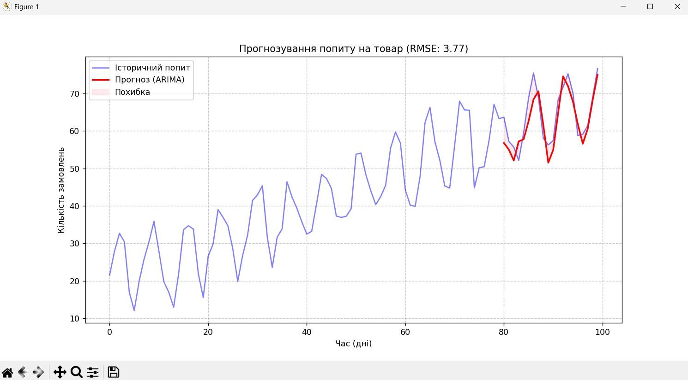

# Лабораторна робота 5: Часові ряди для прогнозування попиту

## Опис завдання

Цією лабораторною роботою вивчаються методи аналізу та прогнозування часових рядів на прикладі прогнозування попиту на товари. Використовується модель **ARIMA** (AutoRegressive Integrated Moving Average) для аналізу історичних даних і передбачення майбутнього попиту.

## Мета

- Розуміння основних концепцій часових рядів
- Навчитися працювати з моделлю ARIMA
- Реалізувати прогнозування попиту на основі історичних даних
- Оцінити точність прогнозу за допомогою метрик помилок

## Установка залежностей

```bash
pip install pandas numpy matplotlib statsmodels scikit-learn
```

### Необхідні бібліотеки:
- **pandas** — робота з часовими рядами і структурованими даними
- **numpy** — математичні операції
- **matplotlib** — візуалізація результатів
- **statsmodels** — реалізація моделі ARIMA
- **scikit-learn** — обчислення метрик якості

## Опис алгоритму

### 1. Генерація/Завантаження даних

Програма генерує синтетичні дані про попит на товар із наступними компонентами:
- **Тренд**: лінійне зростання попиту з часом
- **Сезонність**: періодичні коливання з періодом 7 днів
- **Шум**: випадкові коливання навколо основного тренду

```python
demand = 20 + 0.5 * time + 10 * np.sin(2 * π * time / 7) + noise
```

### 2. Розділення даних

Дані розділяються на:
- **Тренувальний набір** (80%): для навчання моделі
- **Тестовий набір** (20%): для оцінки точності прогнозу

### 3. Модель ARIMA(5, 1, 0)

**ARIMA** складається з трьох компонентів:

| Параметр | Значення | Опис |
|----------|----------|------|
| **p** | 5 | Кількість авторегресійних членів (AR) — залежність від попередніх значень |
| **d** | 1 | Порядок диференціювання (I) — одна диференціація для стабілізації ряду |
| **q** | 0 | Кількість членів середнього рухомого (MA) — використання попередніх помилок |

### 4. Прогнозування

Для кожного кроку тестового набору:
1. Модель навчається на історичних даних
2. Прогнозується значення на один крок вперед
3. Справжнє значення додається до історії для наступної ітерації

### 5. Оцінка якості

Якість прогнозу оцінюється за допомогою **RMSE** (Root Mean Square Error):

$$\text{RMSE} = \sqrt{\frac{1}{n} \sum_{i=1}^{n} (y_i - \hat{y}_i)^2}$$

де:
- $y_i$ — справжнє значення
- $\hat{y}_i$ — прогнозоване значення
- $n$ — кількість точок прогнозу

## Запуск програми

```bash
python Pr5.py
```

### Очікуваний результат

Програма виведе:
1. **Значення RMSE** — середньоквадратична помилка прогнозу
2. **Графік** з трьома елементами:
   - Синя крива — історичні дані про попит
   - Червона крива — прогнозовані значення
   - Рожева область — розбіжність між прогнозом та реальними даними



На графіку видно:
- На першій половині (дні 0-80) — тренування моделі
- На другій половині (дні 80-100) — результати прогнозування
- Червона лінія хорошо стежить за синіми піками попиту
- RMSE: 3.77 вказує на доброю точність прогнозу

## Інтерпретація результатів

- **RMSE < 3**: Модель показує добрі результати для цього датасету
- **Чим менше RMSE, тим точніше прогноз**
- На графіку видно, як модель адаптується до закономірностей у даних

## Можливості для розширення

1. **Використання LSTM**: Імплементувати нейронну мережу LSTM для порівняння результатів
2. **Параметризація**: Експериментувати з різними значеннями (p, d, q)
3. **Дійсні дані**: Завантажити реальні дані про попит із відкритих джерел
4. **Валідація**: Реалізувати k-fold кросс-валідацію
5. **Інтервали довіри**: Додати довірчі інтервали до прогнозів

## Структура проекту

```
Pr5.py          — основний скрипт з реалізацією ARIMA
README.md       — цей файл з документацією
```

## Теоретичні основи

### Що таке часовий ряд?

Часовий ряд — це послідовність даних, впорядкована за часом. Особливості:
- Залежність між послідовними спостереженнями
- Наявність тренду і сезонності
- Стаціонарність або нестаціонарність

### Компоненти часового ряду

$$Y_t = T_t + S_t + E_t$$

де:
- $T_t$ — тренд (загальна тенденція)
- $S_t$ — сезонність (періодичні коливання)
- $E_t$ — білий шум (випадкова складова)

### Чому ARIMA ефективна для прогнозування попиту?

1. **Ефективна для стаціонарних рядів** — диференціювання стабілізує ряд
2. **Простота**: Не вимагає багато гіперпараметрів
3. **Интерпретованість**: Коефіцієнти моделі мають статистичний сенс
4. **Класичний підхід**: Перевірена часом методика в аналітиці

## Висновки

Лабораторна робота демонструє:
- Як підготувати часовий ряд до аналізу
- Як навчити модель ARIMA на історичних даних
- Як оцінити якість прогнозу
- Як візуалізувати результати для аналізу

Ці навички застосовуються в реальних проектах для прогнозування:
- Попиту на товари та послуги
- Продажів
- Цін на акції
- Трафіку на веб-сайтах

